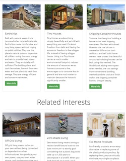
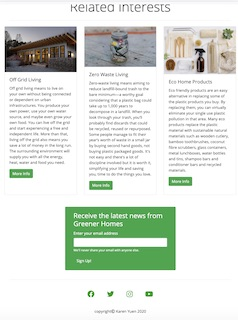

### User journey
1. The home page, reading the information about what this website is about and what an eco home is.

 

2. Scrolling down to the next section of the images and brief description of what an earthship, tiny house and shipping container home is.

3. Then scrolling down to the next section of related interests where the user is introduced to three more ideas of off the grid living, zero waste living and eco home products.

4. At the bottom of the page is a form to sign up to the latest news of Greener Homes, social links. User can also scroll up and click on the more info buttons.